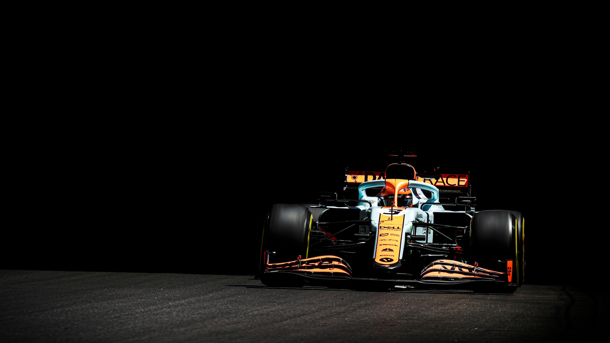
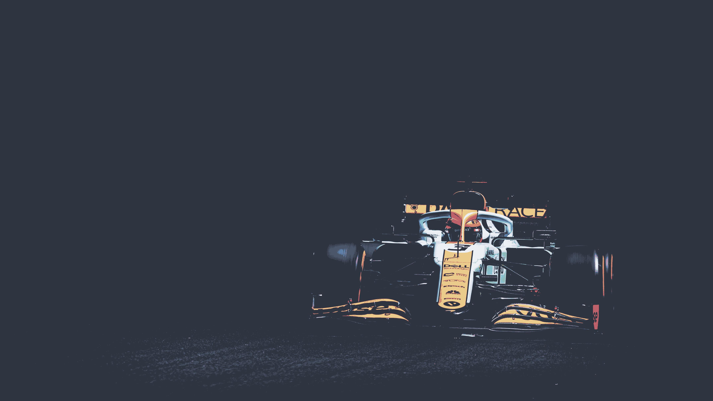

This program is EXTREMELY slow and doesn't produce the results you would expect at all. Eventually I'll learn some actual image processing and redo this. Maybe. Peep the before and after pics below. 




The idea was to take an image and 'nordify' it using the 16 [nord colors](https://www.nordtheme.com/docs/colors-and-palettes). Unfortunately this doesn't look good and changing each pixel individually takes a very very long time. (~2 min for a 4k image on an M1 macbook). If you have a better idea of how to go about nordifying images, please let me know.

Usage for all 0 people that should use this:
```
usage: nordify.py [-h] -i INPUT -o OUTPUT

optional arguments:
  -h, --help            show this help message and exit
  -i INPUT, --input INPUT
                        path to input image
  -o OUTPUT, --output OUTPUT
                        path to output image
```
